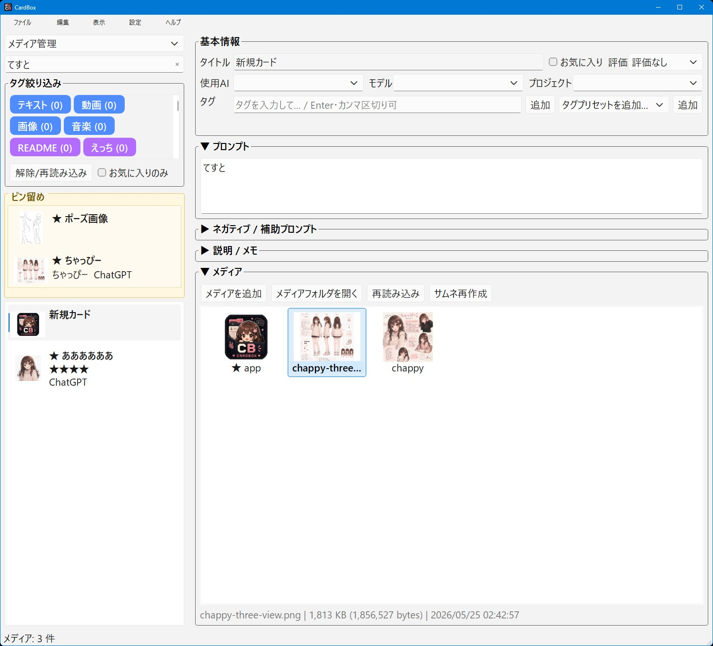

# CardBox



CardBoxは、カード形式で情報・メモ・プロンプト・画像・動画・各種ファイルをまとめて管理するローカル用デスクトップアプリです。
ワークスペースごとに表示項目やタグを切り替えられるので、AIプロンプト管理、メディア整理、ノート管理などを1つのアプリで扱えます。

## 主な機能

* カード形式で情報を管理
* ワークスペース切り替え対応
* ワークスペースごとに表示項目名を変更可能
* ワークスペースごとにタグ管理を分離
* カード一覧のサムネイル表示ON/OFF
* カード一覧の並び替え

  * 更新日時
  * タイトル
* タイトル、選択項目、本文項目、説明メモなどを保存
* 画像・動画・各種ファイルをメディアとしてカードに添付
* メディアのドラッグ＆ドロップ追加
* メディアのコピー、削除、名前変更、ラベル付け、カバー変更
* 画像ビュアー表示
* 動画サムネイル生成
* タグ絞り込み、検索、お気に入り、評価
* ワークスペース削除時のDBバックアップ
* 設定、ウィンドウ状態、並び替え設定を保存
* 日本語ファイル名・日本語フォルダ名に対応
* 既存の `prompt_organizer.db` から `cardbox.db` への初回移行対応

## 一言で言うと

「カード単位で情報とメディアをまとめて管理するツール」

## 使い方

1. **アプリを起動する**

   `cardbox.exe` をダブルクリックして起動します。

   初回起動時、同じフォルダに旧AI Prompt Organizerの `prompt_organizer.db` がある場合は、`cardbox.db` へコピーして移行します。
   元の `prompt_organizer.db` は変更しません。

2. **ワークスペースを選ぶ**

   左上のワークスペース切り替えから、使用するワークスペースを選びます。

   例：

   * メディア管理
   * ノート
   * プロンプト管理
   * 作業メモ

   ワークスペースごとにタグ、表示項目名、カード一覧のサムネイル表示を分けられます。

3. **カードを作成する**

   新規カードを作成して、タイトルや本文を入力します。

   ワークスペース管理から、以下の表示名を用途に合わせて変更できます。

   * 選択項目1
   * 選択項目2
   * 選択項目3
   * 本文項目1
   * 本文項目2
   * 本文項目3

4. **メディアを追加する**

   カードに画像、動画、PDF、テキスト、その他ファイルをメディアとして追加できます。

   メディア一覧へドラッグ＆ドロップするか、追加ボタンからファイルを選択してください。

   主な対応形式：

   * 画像: PNG, JPG, JPEG, WebP, GIF, BMP, ICO, SVG, TIFF, TIF, TGA
   * 動画: MP4, MOV, AVI, MKV, WebM など
   * その他: PDF, TXT, ZIP など、通常ファイル全般

   未分類のファイルは、OSの関連付けで開きます。

5. **カードを検索・整理する**

   検索欄、タグ絞り込み、お気に入り、評価を使ってカードを探せます。

   `表示 > 並び替え` から、カード一覧の並び順を変更できます。

   * 更新日時
   * タイトル

6. **画像やファイルを確認する**

   画像メディアは画像ビュアーで表示できます。
   画像以外のメディアは、OSの関連付けで開けます。

   メディアを右クリックすると、エクスプローラーで表示することもできます。

## 対応ファイル形式について

CardBoxでは、基本的にすべてのファイルをメディアとして登録できます。

画像や動画はサムネイル表示やプレビュー表示に対応します。
それ以外のファイルは、OSの関連付けで開きます。

ただし、ファイル形式や環境によってはサムネイルを生成できない場合があります。
その場合でも、ファイル自体はメディアとして管理できます。

## データ保存について

CardBoxはローカル環境で動作します。
カード情報は `cardbox.db` に保存され、メディアファイルは `assets` フォルダに保存されます。

ネット上にデータをアップロードする仕組みはありません。

## 必要環境

通常は `cardbox.exe` を実行するだけで使えます。

ソースから実行する場合は、以下の環境が必要です。

* Python 3.10以上
* PySide6
* Pillow
* OpenCV Python

pip install例：

```bash
pip install PySide6 Pillow opencv-python
```

## ライセンス

**MIT License** で公開しています。
ご自由に使って、改変して、参考にしてください。
ただし**自作発言はNG**でお願いします。
